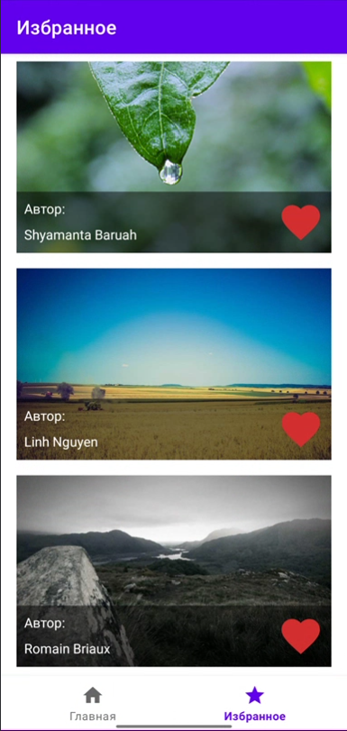

# PictureApp
Browse photos and add to favorites

Это приложение для вывода картинок с ресурса: https://picsum.photos/.
В приложении две вкладки:
1) рандомные картинки
2) любимые картинки
На 1 вкладке по мере скрола погружаются новые пикчи и их можно лайкать, подгрузка автоматическая с пагинацией.
На 2 вкладке лежат лайкнутые пикчи. Лайкнутые так же должны быть доступны для просмотра без интернета.

## Built With
1. Kotlin
2. XML
3. RecyclerView
4. MVVM - Single Activity Architecture
5. Coroutines
6. Clean Architecture
7. Hilt
8. Retrofit 2
9. Paging library
10. Room
11. Mockito

## Gif

## Screenshots
 
